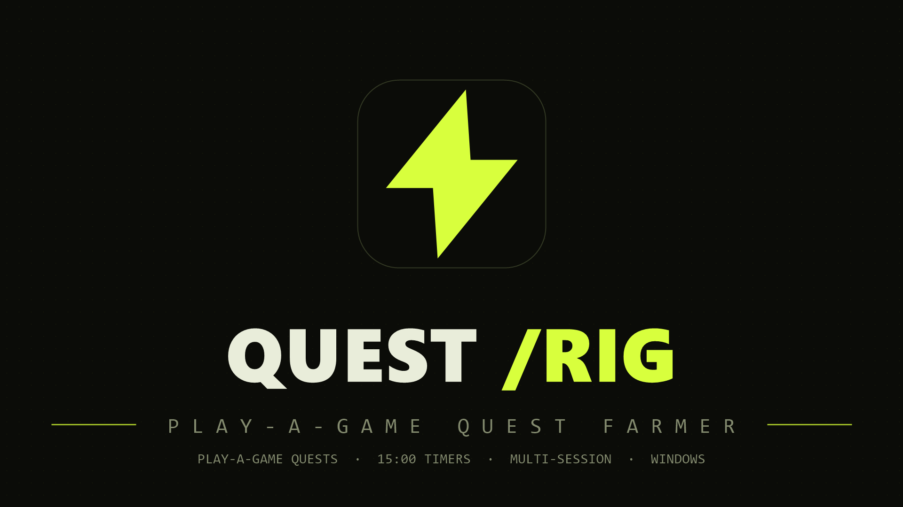
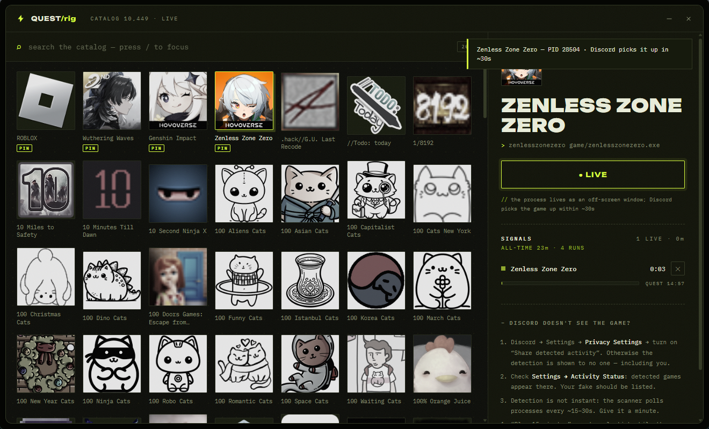

# QUEST/RIG



A Windows rig that fakes running games so **play-a-game quests complete
themselves** — launch a fake, let the timer hit 15:00, claim the reward.
No game installs, no client patching.



## Quest coverage

| Quest type | Works | How |
| --- | --- | --- |
| **Play a game for 15 minutes** (Play on Desktop) | ✅ | the core feature — a fake process with the quest game's exe name |
| **Play 2/3 different games** | ✅ | launch several fakes at once — the catalog is right there, timers run in parallel |
| **Play a specific quest game** | ✅ | search the quest's game by name, launch its fake |
| Watch-a-video / click quests | n/a | just click them in the Quests tab, no fake needed |
| Achievement / in-game progress quests | ❌ | the client verifies real game telemetry — a fake process can't provide it |

While a fake is running, the client sees the game as detected and its
server-side timer accumulates; the app mirrors the 15:00 progress per session
so you know exactly when to claim.

## Download & install

Grab `Quest.Rig_0.3.2_x64-setup.exe` from
[Releases](../../releases) (built automatically by CI on every `v*` tag) and run
it — standard installer with desktop/start-menu shortcuts and an
English/Russian language selector. WebView2 is bundled-installed if missing.

Building from source instead:

```bat
git clone <repo>
cd "Discord Quest"
npm install
dev.bat              :: dev mode with hot reload
npm run tauri build  :: installer + portable exe in src-tauri\target\release\bundle
```

Requires Node 18+ and the Rust toolchain (MSVC target).

## How it works

1. Pulls the detectable-games catalog from
   `discord.com/api/v9/applications/detectable` (straight from the window; on
   failure — via the Rust backend with a cache).
2. Copies a tiny GUI host (`game_host.exe`, ~130 KB, our own binary) under the
   real game's executable name, e.g. `SonsOfTheForest.exe`, into
   `%LOCALAPPDATA%\DiscordQuest\games\`.
3. Launches it as a normal process with a real (but off-screen) window titled
   after the game.
4. The client's process scanner sees a "running game" → the quest ticks.
   Per-session 15-minute progress is shown in the SIGNALS panel.

Sessions are persisted to `%LOCALAPPDATA%\DiscordQuest\sessions.json`:
- processes still alive after an app restart are adopted with their timers
  intact (verified by PID + image path),
- processes that died go to the STASH — hit RESUME and the timer continues
  where it stopped,
- all-time farmed time and run count are kept in the ALL-TIME counter.

## Why the game isn't detected

- In the client: **Settings → Privacy Settings → “Share detected
  activity”** must be ON, otherwise detection is shown to no one — including
  you.
- Detection is not instant: the scanner polls processes every ~15–30 s.
- Achievement quests can't be faked — they need real data from the game itself.

## Controls

- `/` focuses search, `↑↓` select, `Enter` launch, `Esc` reset.
- Double-click a cover to launch. `PIN` pins a game to the top of the list.
- The same game can't be launched twice — a running game shows a LIVE button.
- `✕` on a session stops the process (the fake exe is deleted).

## Project notes

- `scripts/ensure-host.mjs` compiles `game_host.exe` (a separate workspace
  crate, `src-tauri/game-host/`) and stages it into `src-tauri/binaries/` —
  Tauri validates the bundle resource on every cargo invocation.
- `scripts/tauri.mjs` wraps the Tauri CLI: it stages the window icon into
  `%LOCALAPPDATA%\DiscordQuest\` and overrides `bundle.icon` via
  `TAURI_CONFIG`, because tauri-winres mangles build paths containing
  apostrophes (e.g. `C:\Project's\...` → RC2135).
- `scripts/generate-icon.mjs` renders the multi-size `icon.ico`,
  `scripts/make-banner.ps1` renders `docs/banner.png`.
- `game_host` is a separate crate so it can be built without triggering
  Tauri's build script (which validates bundle resources).

## Disclaimer

Educational tool. This targets a specific chat client's quest system and
violates its ToS — use at your own risk.
Licensed under [MIT](LICENSE).
